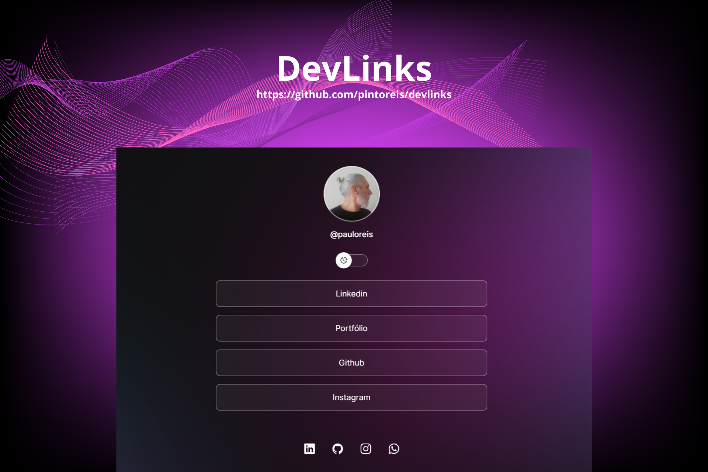

<h1 align="center"> devlinks </h1>

Rocketseat Discover - Course Project  
<a href="https://www.rocketseat.com.br/discover">Study this project in video format by clicking here!</a>

  <a href="#-technologies">Technologies</a>&nbsp;&nbsp;&nbsp;|&nbsp;&nbsp;&nbsp;
  <a href="#-project">Project</a>&nbsp;&nbsp;&nbsp;|&nbsp;&nbsp;&nbsp;
  <a href="#-layout">Layout</a>&nbsp;&nbsp;&nbsp;|&nbsp;&nbsp;&nbsp;
  <a href="#memo-licença">License</a>

  

  

## 🚀 Technologies

This project was developed with the following technologies:

- HTML and CSS
- JavaScript
- Git and Github
- Figma

## 💻 Project

devlinks is a link aggregator to use as an online business card.

- [Aceda ao projeto finalizado, online](https://github.com/pintoreis/devlinks)

- [Assistir aulas](https://lp.rocketseat.com.br/devlinks/inscricao?utm_source=github&utm_medium=descricao&utm_campaign=capture-devlinks&utm_term=organic&utm_content=descricao-github-paulo-reis)

## 🔖 Layout

Você pode visualizar o layout do projeto através deste [LINK](https://www.figma.com/community/file/1187422022288947321). É necessário ter conta no [Figma](https://figma.com) para aceder.

## :memo: Licença

Esse projeto está sob a licença MIT.

---

Feito com ♥ Paulo Reis :wave: [Conecte-se. Vamos trabalhar juntos!](https://www.linkedin.com/in/paulopintoreis/)
